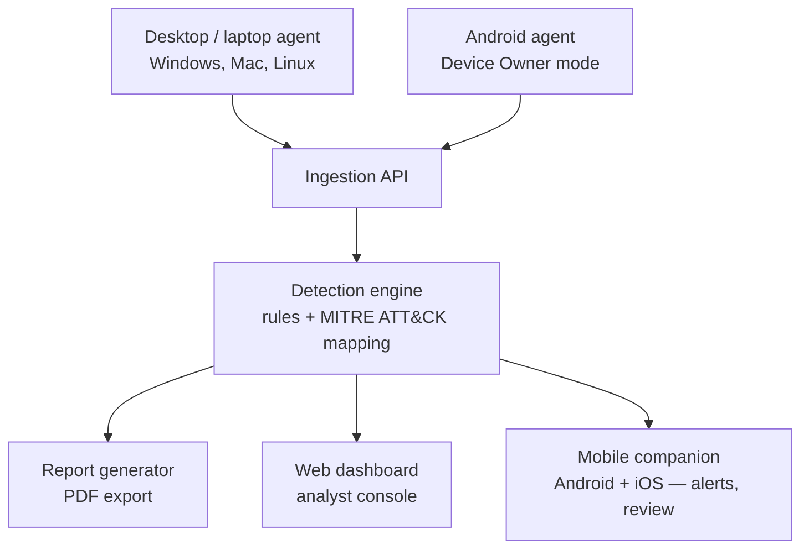

# CyberSecOps Competition App — System Design

## 1. Overview

Entry for a CyberSecOps competition (Cyberus Competitions), following selection via the Certified Offensive Security Explorer (COSE) certification.

- **Team:** 2 people
- **Timeline:** 1 month
- **Deliverables:** both a mobile app and a web app
- **Scope:** real, fully-implemented functionality — no staged or demo-only features

## 2. Mandatory Requirements

### Feature 1 — Threat Detection & Reporting
Detect a potential threat, assess its impact, suggest security measures, and generate an analysis PDF report.

### Feature 2 — Device Monitoring
Monitor org devices (phones, laptops, tablets, printers) across branches:
- Visibility into what each user has access to
- Visual view of user activity
- Print logs
- Sites visited
- URLs copied/pasted
- Call logs
- Realtime visual (camera) access

## 3. Scoping Decisions

These decisions balance legal/ethical exposure and real platform constraints against the one-month timeline:

| Requirement (as written) | Scoped as | Why |
|---|---|---|
| Realtime camera access | Anomaly-triggered snapshot (e.g. N failed logins → single timestamped still) | Matches how real insider-threat products (Teramind, Veriato) actually do this; continuous streaming is a much bigger and harder-to-secure build |
| Call monitoring ("who called who") | Call metadata only (caller, callee, timestamp, duration) — no audio content | Recording call content without both parties' knowledge is illegal in many jurisdictions regardless of device ownership; metadata logging is standard MDM/telephony practice |
| iOS device monitoring | Mobile companion app only (alerts, review, approve actions); full agent out of scope | Apple's sandboxing blocks third-party call log access entirely and gates background clipboard/browsing monitoring behind an MDM entitlement Apple only grants to approved vendors after a multi-week review |
| Android device monitoring | Full Device Owner agent | Android's Device Owner mode makes this genuinely buildable in the timeframe |

Everything the device agents collect sits inside a consent + audit boundary: agents run on org-managed devices, and every dashboard view of monitoring data is logged (who looked at what, when).

## 4. System Architecture

All components in this flow operate inside the consent + audit boundary described above.

## 5. Standout Features

Chosen to reuse existing infrastructure rather than add new subsystems:

- **MITRE ATT&CK Navigator export** — aggregate tagged events into the official Navigator JSON layer format
- **Signed, hash-verified PDF reports** — each report signed on generation with a verify step, backing the chain-of-custody framing
- **Executive vs analyst report toggle** — same generator, two templates (raw IOCs/MITRE IDs vs plain-language business impact)
- **Risk-ranked dashboard** — composite score per user/device (frequency × technique severity × asset criticality)
- **Per-user baselining** — rolling average + standard deviation per user (login times, data volume, print volume) rather than fixed global thresholds only
- **Branch map view** — Leaflet map, branches color-coded by current alert level
- **Audit trail viewer** — who on the team viewed whose monitoring data and when

## 6. Tech Stack

### Backend / core services
- Python 3.11+, FastAPI (ingestion API, detection engine, dashboard rendering, WebSocket endpoints)
- PostgreSQL — events, devices, users, alerts, audit log
- SQLAlchemy 2.0 (async) + Alembic for migrations
- Redis — pub/sub for live alert fan-out, Celery broker
- Celery — runs detection rules, baselining, and report generation off the request path
- Auth: JWT (fastapi-users or python-jose) with roles (analyst / admin / executive-viewer)

### Desktop agent (Windows / Mac / Linux)
- Python 3.11+, single codebase
- `pyperclip` (clipboard), direct SQLite parsing of Chrome/Firefox/Edge history, `psutil` (process info)
- Print: `pywin32`/`win32print` on Windows, `pycups` on Mac/Linux — the one real per-OS branch
- PyInstaller for packaging; Windows Service / launchd / systemd for background execution
- Local SQLite buffer for offline queuing

### Android agent
- Kotlin, native — Device Owner mode, `UsageStatsManager`, `READ_CALL_LOG`, CameraX, Accessibility Service
- Room (local buffer), WorkManager (scheduled sync), Retrofit + OkHttp

### Mobile companion (Android + iOS)
- Flutter/Dart
- Riverpod (state), `dio` (REST), `web_socket_channel` (live alerts), Firebase Cloud Messaging (push)

### Web dashboard
- FastAPI + Jinja2 templates, Tailwind
- Vanilla JS in `static/js/`, wrapped in `DOMContentLoaded`
- Chart.js (risk-score trends), Leaflet.js (branch map)
- Native WebSocket connection for live updates

### Analytics
- pandas for rolling-average/stddev baselining (periodic Celery task)
- Local MITRE ATT&CK JSON dataset for technique lookups and Navigator export — no live API dependency

### Dev / infra
- Docker Compose locally (Postgres + Redis + backend)
- Single small VPS for the judging period
- `.env` + python-dotenv for secrets (never committed)

## 7. Build Priority

Ordered so the project is demoable even if later steps get cut:

1. Backend — ingestion API, detection engine, report generator
2. Desktop agent (Python, cross-platform)
3. Android agent
4. Web dashboard
5. Mobile companion app (Android + iOS)
6. iOS agent — documented as future work (Apple Business Manager + supervised MDM enrollment), not built

Steps 1–4 alone satisfy "both a mobile and web app."

## 8. Team Split (proposed)

- **Person A:** backend (ingestion API, detection engine, report generator) + desktop agent — these share the same event schema
- **Person B:** Android agent + web dashboard + mobile companion — the OS-specific mobile work and the UI that displays it tend to iterate together

Pending confirmation based on which of you is stronger on which side.
